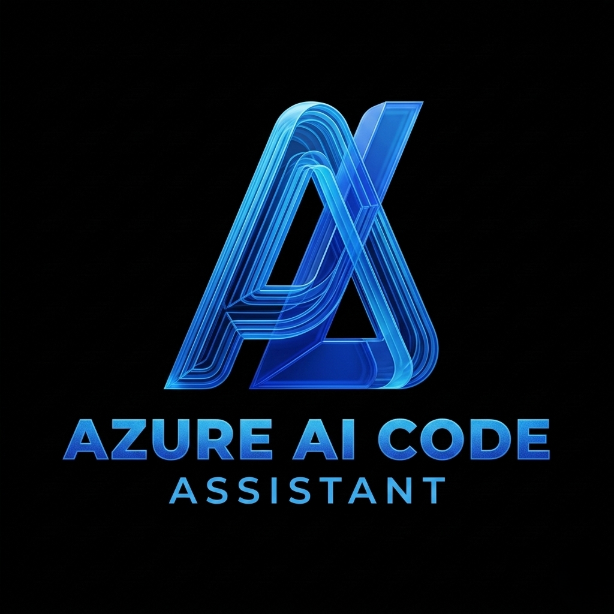
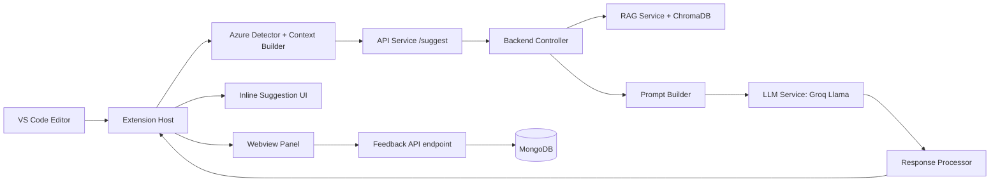

# <div align="center">⚡ Azure AI Code Assistant</div>

<div align="center">
	
</div>

<div align="center">


</div>

AI-powered Azure SDK coding assistant for VS Code with inline suggestions, RAG-backed retrieval, feedback collection, and companion product UI.

## 🌟 Overview
This repository contains a full-stack project:
- A **VS Code extension** that detects Azure coding context and generates inline suggestions.
- A **backend API** that analyzes context, retrieves relevant Azure docs, and generates completions via LLM.
- A **webview app** for in-editor suggestion display.
- A **frontend landing website** for demos and product presentation.

## ✨ Key Features
- `⚡` Copilot-style inline ghost text suggestions inside VS Code.
- `🧠` Azure-aware detection for JS/TS/C# (`storage`, `cosmos`, `identity`, `keyvault`, `service-bus`, etc.).
- `🔎` RAG pipeline using ChromaDB + embedding service for documentation grounding.
- `🧹` Suggestion cleaning and deduplication before display.
- `🛠️` Quick Fixes + automatic Azure import injection.
- `⭐` Feedback endpoint and storage for continuous improvement.
- `🧪` Mock/fallback behavior for local development without full cloud setup.

## 🏗️ Architecture


## 🧩 Repository Structure
```text
Doppelganger-March-2026-Eklavya/
├── README.md
└── azure-ai-code-extension/
		├── backend/                  # Express API + RAG + feedback persistence
		├── docs/                     # Architecture and flow docs
		├── extension/                # VS Code extension host + webview + frontend
		├── scripts/                  # Cross-platform install/start scripts
		└── shared/                   # Shared constants and types
```

## 🔧 Core Modules

### VS Code Extension (`azure-ai-code-extension/extension/src`)
- `extension.ts`: activation, provider registration, commands, webview messaging.
- `inlineProvider.ts`: inline completion generation pipeline.
- `codeWatcher.ts`: debounced typing watcher + manual trigger flow.
- `azureDetector.ts`: Azure context detection.
- `contextBuilder.ts`: payload builder for backend requests.
- `apiService.ts`: backend call, normalization, overlap removal, fallback logic.
- `importFixer.ts` and `importInjector.ts`: quick fixes and import automation.
- `feedbackService.ts`: feedback posting and lightweight intent detection.

### Backend (`azure-ai-code-extension/backend/src`)
- `server.js`: Express app, middleware, route wiring, health check.
- `controllers/suggestController.js`: end-to-end suggestion pipeline orchestration.
- `services/contextAnalyzer.js`: sdk + intent detection.
- `services/ragService.js`: vector retrieval with optional sdk filtering.
- `services/promptBuilder.js`: prompt construction.
- `services/llmService.js`: Groq LLM call + mock fallback.
- `services/responseProcessor.js`: output cleanup.
- `controllers/feedbackController.js`: feedback validation + MongoDB persistence.

### UI Apps
- `extension/webview`: React app rendered in VS Code panel.
- `extension/frontend`: React marketing/demo website for the project.

## 🚀 Quick Start

### 1. Install dependencies
From `azure-ai-code-extension`:

Windows PowerShell:
```powershell
.\scripts\install-all.ps1
```

macOS/Linux:
```bash
./scripts/install-all.sh
```

### 2. Configure backend environment
Create `azure-ai-code-extension/backend/.env` from `.env.example` and set values:

```env
PORT=3000
GROQ_API_KEY=your_key_here
GROQ_MODEL=llama-3.3-70b-versatile
OPENAI_API_KEY=your_openai_key_if_using_openai_embeddings
EMBEDDING_PROVIDER=local
EMBEDDING_DIM=384
CHROMA_DB_PATH=http://localhost:8000
MONGO_URI=mongodb://localhost:27017/azure-ai-assistant
```

### 3. Start backend + extension watch mode
From `azure-ai-code-extension`:

Windows PowerShell:
```powershell
.\scripts\start-dev.ps1
```

macOS/Linux:
```bash
./scripts/start-dev.sh
```

### 4. Run extension in VS Code
1. Open `azure-ai-code-extension/extension` in VS Code.
2. Press `F5` to launch Extension Development Host.
3. Ensure `editor.inlineSuggest.enabled = true`.
4. Open a JS/TS/C# file and start typing Azure SDK code.

## 🧪 Backend Commands
From `azure-ai-code-extension/backend`:

```bash
npm run dev           # start API with nodemon
npm run embed:chunks  # embed docs into ChromaDB
npm run test:rag      # run RAG smoke test
npm run test:filtering
```

## 🔌 API Endpoints

### `GET /health`
Returns service health.

### `POST /suggest`
Request:
```json
{
	"language": "typescript",
	"imports": ["@azure/storage-blob"],
	"currentLine": "const blobServiceClient = new",
	"context": "previous code",
	"cursorPosition": { "line": 14, "character": 28 }
}
```

Response:
```json
{
	"suggestion": "const blobServiceClient = new BlobServiceClient(...)"
}
```

### `POST /feedback`
Request:
```json
{
	"suggestion": "...",
	"rating": "positive",
	"sdkType": "blob-storage",
	"intent": "upload-data"
}
```

## 📚 Documentation Map
- Project architecture: `azure-ai-code-extension/docs/architecture.md`
- Extension flow: `azure-ai-code-extension/docs/extension-flow.md`
- Backend setup: `azure-ai-code-extension/backend/BACKEND_SETUP_GUIDE.md`
- RAG setup: `azure-ai-code-extension/backend/RAG_PIPELINE_SETUP.md`
- Extension analysis: `azure-ai-code-extension/extension/EXTENSION_ANALYSIS.md`
- Frontend website overview: `azure-ai-code-extension/extension/frontend/WEBSITE_OVERVIEW.md`

## 🤝 Team
Built by **Team Eklavya** for the March 2026 hackathon.

## 📄 License
See `azure-ai-code-extension/extension/LICENSE`.

## ☁️ Supported Azure Services

| Service | JS/TS Import | C# Using |
|---------|---------------|----------|
| Azure Blob Storage | @azure/storage-blob | Azure.Storage.Blobs |
| Azure Cosmos DB | @azure/cosmos | Azure.Cosmos |
| Azure Key Vault | @azure/keyvault-secrets | Azure.Security.KeyVault.Secrets |
| Azure Identity | @azure/identity | Azure.Identity |
| Azure Service Bus | @azure/service-bus | Microsoft.Azure.ServiceBus |
| Azure Event Hubs | @azure/event-hubs | Microsoft.Azure.EventHubs |
| Azure AI Text Analytics | @azure/ai-text-analytics | (coming soon) |
| Azure Communication | @azure/communication-sms | (coming soon) |
| Azure Cognitive Search | @azure/search-documents | (coming soon) |

---

## 🏆 Hackathon

- Built in: 24-48 hours
- Category: AI + Cloud + Developer Tools
- Key Innovation: Context-injected Azure knowledge (eliminates AI hallucinations)
- Unique Features list:
	- Intent detection from comments (`// I need to upload to blob → full function`)
	- Mock mode for zero-dependency development
	- Security-first: always suggests DefaultAzureCredential over connection strings
	- Multi-layer caching: session + Redis = 80%+ API call reduction
	- One boolean to switch from mock to real backend

---

## 👥 Team

| Name | Role | Responsibility |
|------|------|----------------|
| Arjun | Extension Developer | codeWatcher, azureDetector, contextBuilder, apiService |
| Dhruvesh | UI Developer | Webview panel, React sidebar, accept/reject UI |
| Priy Mavani | Backend Developer | Express API, Azure OpenAI integration |
| Mayank Dudhatra | Backend Developer | RAG system, Redis caching, Azure, deployment, Researcher, Feedback system |

---


---

## 📄 License

MIT License - feel free to use, modify, and distribute.

<p align="center">
	Built with ❤️ using Azure OpenAI, VS Code API, and TypeScript
	<br/>
	Made for Hackathon 2025
</p>
